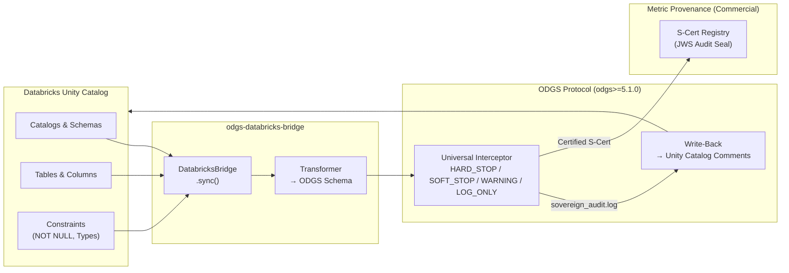

# ODGS Databricks Bridge

[](https://opensource.org/licenses/Apache-2.0)
[](https://github.com/MetricProvenance/odgs-protocol)
[](https://pypi.org/project/odgs-databricks-bridge/)
[](https://pypi.org/project/odgs-databricks-bridge/)

**Transform your Databricks Unity Catalog into active ODGS runtime enforcement schemas.**

> Unity Catalog describes your data. ODGS enforces it.

The ODGS Databricks Bridge is an **institutional connector** that translates Databricks Unity Catalog table and column metadata into cryptographically addressable ODGS enforcement schemas. It converts passive catalog definitions — column constraints, non-nullable fields, type assertions — into mechanically executable governance rules enforced at pipeline runtime.

Architecturally aligned with **CEN/CENELEC JTC 25** and **NEN 381 525** federated data sovereignty principles.

---

## Architecture



---

## What Gets Generated

| Unity Catalog Input | ODGS Output Type | Rule Example |
|---|---|---|
| Table metadata | `metrics` | Metric definitions with full column schemas |
| Non-nullable columns | `rules` (HARD_STOP) | `revenue.amount IS NOT NULL` |
| Column data type | `rules` (WARNING) | `type(amount) == 'decimal'` |

---

## Install

```bash
pip install odgs-databricks-bridge
```

---

## Quick Start

### Python API

```python
from odgs_databricks import DatabricksBridge

bridge = DatabricksBridge(
    workspace_url="https://adb-1234567890.azuredatabricks.net",
    token="dapi...",
    organization="acme_corp",
)

# Sync all tables from a catalog → ODGS metric definitions
bridge.sync(
    catalog="production",
    output_dir="./schemas/custom/",
    output_type="metrics",
)

# Sync column constraints → ODGS enforcement rules
bridge.sync(
    catalog="production",
    schema_filter="finance",
    output_dir="./schemas/custom/",
    output_type="rules",
    severity="HARD_STOP",
)
```

### CLI

```bash
# Using standard Databricks SDK environment variables
export DATABRICKS_HOST=https://adb-1234567890.azuredatabricks.net
export DATABRICKS_TOKEN=dapi...

odgs-databricks sync \
    --org acme_corp \
    --catalog production \
    --schema finance \
    --type rules \
    --severity HARD_STOP \
    --output ./schemas/custom/

# Push compliance results back to Unity Catalog table comments
odgs-databricks write-back \
    --log-path ./sovereign_audit.log \
    --url https://adb-1234567890.azuredatabricks.net \
    --token dapi...
```

### Output Schema

```json
{
  "$schema": "https://metricprovenance.com/schemas/odgs/v5",
  "metadata": {
    "source": "databricks",
    "organization": "acme_corp",
    "tables_processed": 12,
    "items_generated": 47
  },
  "items": [
    {
      "rule_urn": "urn:odgs:custom:acme_corp:rule:revenue_amount_not_null",
      "name": "revenue.amount NOT NULL",
      "severity": "HARD_STOP",
      "constraint_type": "NOT_NULL",
      "target_table": "production.finance.revenue",
      "plain_english_description": "The revenue amount field must never be null in financial transaction records",
      "content_hash": "a1b2c3..."
    }
  ]
}
```

---

## Bi-Directional Write-Backs

The bridge supports **Bi-Directional Sync**: it parses your `sovereign_audit.log` offline and pushes compliance results back into Unity Catalog table comments — creating a seamless feedback loop for Data Stewards without compromising the air-gapped nature of the core ODGS protocol.

---

## Authentication

| Method | CLI Flag | Environment Variable |
|---|---|---|
| Personal Access Token | `--token` | `DATABRICKS_TOKEN` |
| Workspace URL | `--url` | `DATABRICKS_HOST` |

---

## Regulatory Alignment

This bridge is designed for organisations governed by:

| Regulation | Relevance |
|---|---|
| **DORA (Regulation EU 2022/2554)** | ICT resilience — data lineage and operational incident traceability across Databricks workloads |
| **EU AI Act (2024/1689) Articles 10 & 12** | Training data governance and audit trail requirements for High-Risk AI Systems built on Databricks |
| **Basel Committee BCBS 239** | Risk data aggregation — accuracy and integrity of data sourced from Unity Catalog |
| **NEN 381 525** | Dutch federated data sovereignty standard |

> For cryptographic legal indemnity (Ed25519 JWS audit seals, certified Sovereign Packs for DORA/EU AI Act), see the **[Metric Provenance Enterprise Platform](https://platform.metricprovenance.com)**.

---

## Requirements

- Python ≥ 3.9
- `odgs` ≥ 5.1.0 (core protocol — v6.0 compatible)
- Databricks workspace with Unity Catalog enabled

---

## Related

- [ODGS Protocol](https://github.com/MetricProvenance/odgs-protocol) — The core enforcement engine
- [ODGS FLINT Bridge](https://github.com/MetricProvenance/odgs-flint-bridge) — TNO FLINT legal ontology connector
- [ODGS Collibra Bridge](https://github.com/MetricProvenance/odgs-collibra-bridge) — Collibra integration
- [ODGS Snowflake Bridge](https://github.com/MetricProvenance/odgs-snowflake-bridge) — Snowflake integration

---

## License

Apache 2.0 — [Metric Provenance](https://metricprovenance.com) | The Hague, NL 🇳🇱
